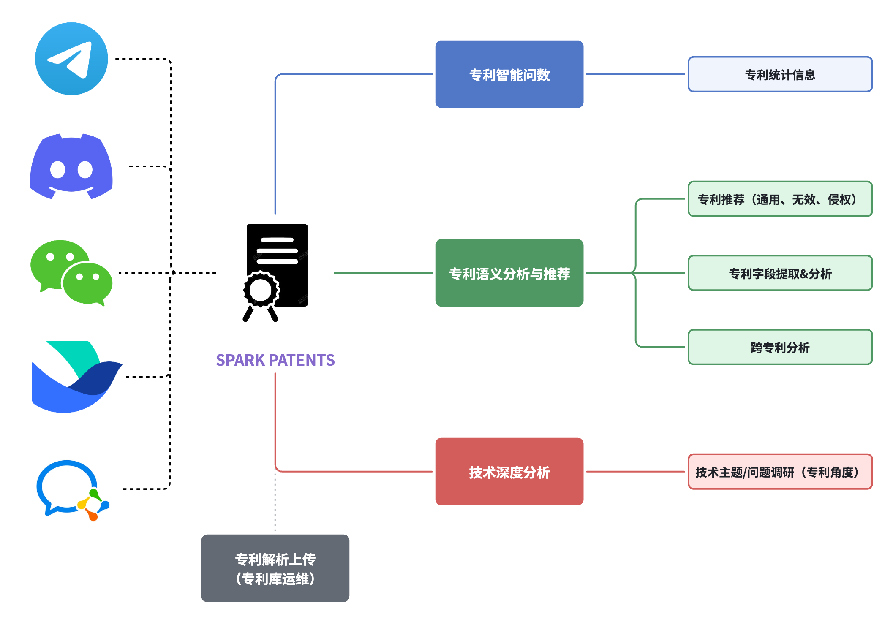

# Spark Patents
NVIDIA DGX Spark Hackathon 项目展示   Spark Folks 小组  
来自 [**RIOS Lab**](https://www.rioslab.org/) & [**HPGC Lab**](https://www.thuhpgc.net/)

## 项目简介

<strong>RISC-V 国际开源实验室（RIOS Lab）</strong>早在 2022 年就已经开始布局 IP 研究，受益于大规模语言模型等前沿技术的高速推动，在高质量专利数据库和 IP 领域内知识积累（来自 IP 律师、学者）的基础上成功自动化了诸多专利处理上的工作流程，用于帮助 IP 从业者极大地提升工作效率。例如在专利的稳定性分析场景下，原本专利律师需要耗时至少 2～3 周，但有了高效的专利推荐和语义分析工具以后，该流程可以缩短至几分钟内。

感谢<strong> NVIDIA DGX SPARK Hackathon 2026 赛办方</strong>的组织和<strong>清华大学高性能计算实验室（HPGC Lab）</strong>提供的人员和算力硬件支持，我们首次将多维度专利处理智能体化并部署在前沿的 AI 推理硬件上，这些多维度的服务涉及专利检索、专利推荐（IP 保护）、单专利语义分析、跨专利语义分析、专利智能问数（统计分析）、技术问答（深度分析）等。

出于成果隐私保护，该项目的代码暂时不开源，并且当前成果仍处于轻量化的概念验证阶段（PoC），但会在未来完善后以 RIOS Lab 开源专利平台的形式开放给公众使用和二次开发。

- **技术报告**：[Spark Patents 技术报告](./SparkPatents技术报告.pdf)
- **成果演示**：[Spark Patents 对话演示](https://www.bilibili.com/video/BV1riDsBaECQ/?spm_id_from=333.1387.homepage.video_card.click&vd_source=0ce0693e07698024c63cd3ac1a68ff7b)

## 核心优势

- <strong>市面上专利处理维度最全面的AI智能体</strong>：涉及专利语义分析与推荐、专利智能问数、技术深度分析、原始专利解析与上传四大功能模块。
- <strong>智能体的垂类专业性</strong>：集成了知识产权律师和学者的领域内知识。
- <strong>用户友好交互</strong>：支持 10+ 主流通信 APP 的集成，如微信、企业微信、飞书、Discord 等。
- <strong>基建的可靠性</strong>：基于英伟达高性能推理硬件 DGX Spark 和 CUDA 加速框架，成功搭建支持高并发请求、具备灵活可扩展性的 Agent 基建。
    - 大模型服务节点的可扩展性：负载均衡模块支持
    - 数据库的可扩展性：Milvus & PostgreSQL -> Elastic
    - 通用智能体框架的可扩展性：Nanobot -> OpenClaw 或 集成更多的技能

## 代码片段展示

尽管代码不开源，我们愿意提供一些代码片段和相关截图；如果赛办方需要进一步了解代码细节，可以直接联系我们。

- 模型部署模块：[models-deployment](models-deployment/README.md)
- 专利 AI 服务模块：[patent-services](patent-services/README.md)
- 数据库管理模块：[patent-database](patent-database/README.md)
