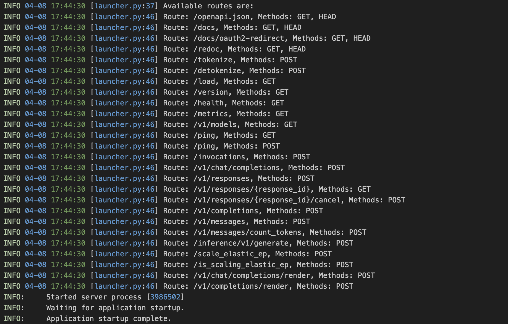
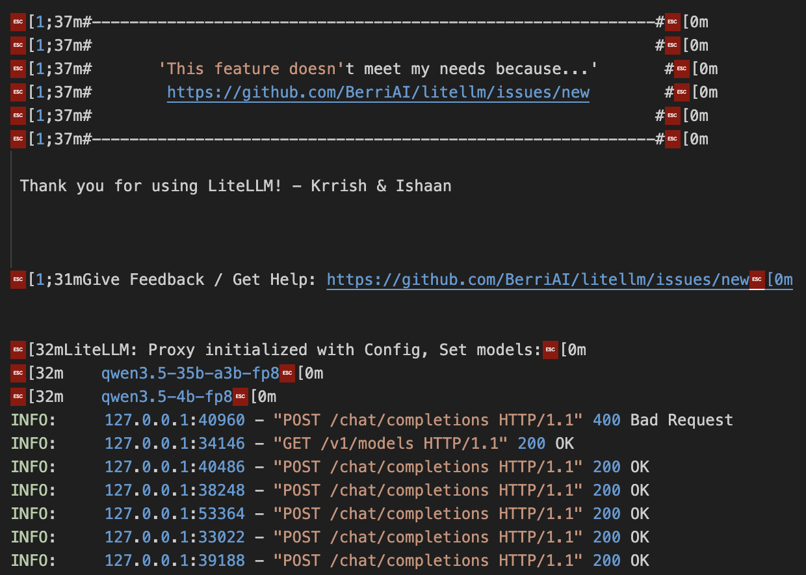

# 模型部署 (Models Deployment)
代码片段/日志截取

主要使用了以下三个模型：
- Qwen3.5-35B-A3B-fp8
- Qwen3.5-4B (fp8量化部署)
- Qwen3.5-Embedding-0.6B

## LLM 部署示例

以下是使用 vLLM 部署 Qwen3.5-35B-A3B-fp8 的命令样例。

```shell
nohup vllm serve ${MODEL_PATH} \
    --port 10101 \
    --served-model-name qwen3.5-35b-a3b-fp8 \
    --max-model-len 32768 \
    --max-num-seqs 2 \
    --gpu-memory-utilization 0.4 \
    --attention-backend FLASH_ATTN \
    --enable-prefix-caching \
    --enable-auto-tool-choice \
    --tool-call-parser qwen3_coder \
    --default-chat-template-kwargs '{"enable_thinking": false}' \
> ./logs/qwen3.5_35b_a3b_fp8.log 2>&1 &
```

vLLM server 成功运行：



## 负载均衡示例

以下是使用 LiteLLM 在单台机器上的配置文件样例。

```yaml
model_list:
  - model_name: qwen3.5-35b-a3b-fp8
    litellm_params:
      model: hosted_vllm/qwen3.5-35b-a3b-fp8
      api_base: http://localhost:10101/v1/chat/completions
      rpm: 30  # requests per minute
  - model_name: qwen3.5-4b-fp8
    litellm_params:
      model: hosted_vllm/qwen3.5-4b-fp8
      api_base: http://localhost:10102/v1/chat/completions
      rpm: 30  # requests per minute

router_settings:
  routing_strategy: simple-shuffle
```

LiteLLM server 运行成功：


