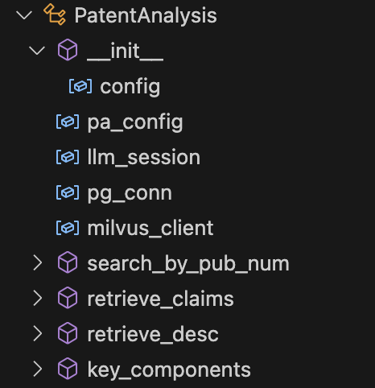

# 专利 AI 服务 (Patents AI Services)
代码片段/日志截取

## AI 服务框架一览（部分）



## 双专利库的接入

连接 PostgreSQL 和 Milvus。

```python
class PatentAnalysis:

    def __init__(self, config: dict):
        # parameters
        self.pa_config = config
        self.llm_session = requests.Session()
        # initialized
        self.pg_conn = psycopg2.connect(
            host = self.pa_config["pg_host"],
            port = self.pa_config["pg_port"],
            dbname = self.pa_config["pg_dbname"],
            user = self.pa_config["pg_user"],
            password = self.pa_config["pg_password"]
        )
        self.milvus_client = MilvusClient(
            uri = self.pa_config["milvus_uri"],
            token = self.pa_config["milvus_token"]
        )
```

## 混合检索 - 跨字段向量检索

在进行跨字段向量检索时的代码片段。

```python
        # cross-vector hybrid search
        fields_order = ["title_vec", "abstract_vec", "claims_vec", "description_vec"]
        tar_pat_vec = {"title_vec": query_embed, "abstract_vec": query_embed, \
                       "claims_vec": query_embed*2, "description_vec": query_embed*2}
        search_reqs = self._hybrid_search_format(tar_pat_vec, fields_order)
        weights = [DEFAULT_WEIGHTS[k] for k in fields_order]
        ranker = WeightedRanker(*weights)
        hybrid_res = {}
        for collect_name in [self.pa_config["zh_collection_name"], \
                             self.pa_config["en_collection_name"]]:
            hybrid_res[collect_name] = self.milvus_client.hybrid_search(
                collection_name=collect_name,
                reqs=search_reqs,
                ranker=ranker,
                limit=self.pa_config["milvus_search_limit"],
                output_fields=["publication_number"],
            )[0]
```